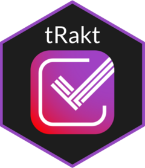

<!-- README.md is generated from README.Rmd. Please edit that file -->

```{r setup, include = FALSE}
knitr::opts_chunk$set(
  cache = TRUE,
  collapse = TRUE,
  comment = "#>",
  fig.path = "man/figures/README-",
  out.width = "100%",
  message = FALSE, warning = FALSE, error = FALSE
)
```

# tRakt <a href="https://jemus42.github.io/tRakt"></a>

<!-- badges: start -->
[](https://github.com/jemus42/tRakt/actions/workflows/R-CMD-check.yaml)
[](https://cran.r-project.org/package=tRakt)
[](https://github.com/jemus42/tRakt/releases)
[](https://www.repostatus.org/#wip)
[](https://app.codecov.io/gh/jemus42/tRakt)
<!-- badges: end -->

`tRakt` lets you retrieve data from [trakt.tv](https://trakt.tv/), a site similar to [IMDb](https://imdb.com) with a wider focus, yet smaller user base. The site also enables media-center integration, so you can automatically sync your collection and watch progress, as well as scrobble playback and ratings via [Plex](https://www.plex.tv/), [Kodi](https://kodi.tv/) and streaming services like Netflix and AppleTV+.  
And, most importantly, [trakt.tv has a publicly available API](https://trakt.docs.apiary.io), which makes this package possible and allows you to collect all that nice data people have contributed.

Please note that while this package is *basically* an API-client, it is a little more opinionated and might deliver results that do not exactly match the data delivered by the API. The primary motivation for this package is to retrieve data that is easily processable for data analysis and display, which is why it tries hard to coerce most data into tabular form instead of using nested lists, which is what the direct translation of the API results would look like.

## Installation

Get it from GitHub:

```r
if (!("pak" %in% installed.packages())) {
  install.packages("pak")
}
pak::pak("jemus42/tRakt")

```

...or from [r-universe](https://jemus42.r-universe.dev/tRakt):

```r
install.packages("tRakt", repos = "https://jemus42.r-universe.dev")
```

## Usage

```{r}
library(tRakt)
library(dplyr) # for convenience
```

Search for a specific show from 2013 (and not the US adaptation) and get basic info:

```{r}
show_info <- search_query("Utopia", year = "2013", type = "show")
glimpse(show_info)
```

We'll use the `$trakt` ID for subsequent requests.

Get season information for the show using its trakt ID:

```{r}
seasons_summary(show_info$trakt, extended = "full") |>
  glimpse()
```

Get episode data for the first season, this time using the show's URL slug:

```{r}
seasons_season(show_info$trakt, seasons = 1, extended = "full") |>
  glimpse()
```

You cann also get episode data for all seasons, but note that episodes will be included as a list-column and need further unpacking:

```{r}
seasons_summary(show_info$trakt, episodes = TRUE, extended = "full") |>
  pull(episodes) |>
  bind_rows() |>
  glimpse()
```

Or alternatively, get the [trending shows](https://trakt.tv/shows/trending):

```{r}
shows_trending()
```

Maybe you just want to know how long it would take you to binge through these shows:

```{r}
shows_trending(extended = "full") |>
  transmute(
    show = glue::glue("{title} ({year})"),
    runtime_hms = hms::hms(minutes = runtime),
    aired_episodes = aired_episodes,
    runtime_aired = hms::hms(minutes = runtime * aired_episodes)
  ) |>
  knitr::kable(
    col.names = c("Show", "Episode Runtime", "Aired Episodes", "Total Runtime (aired)")
  )
```

Please note though that episode runtime data may be inaccurate. In my experience, recent shows have fairly accurate runtime data, which is often not the case for older shows.

## Credentials

The API requires at least a `client id` for the API calls.  
Loading the package (or calling its functions via `tRakt::` wil automatically set the app's credentials for authentication, but for extended use you should set your own credentials via environment variables in your `.Renviron` like this:

```sh
# tRakt
trakt_client_id=12fc1de7[...]3d629afdf2
trakt_client_secret=justabunchofstuffhere
```

* `trakt_client_id` **Required**. It's used in the HTTP headers for the API calls, which is kind of a biggie.
* `trakt_client_secret`: **Optional**(ish). This is only required if you intend to make an authenticated request, which is only required by a small number of implemented API methods (see `vignette("Implemented-API-methods")`). You can use this package perfectly fine for basic data collection and you can authenticate using the package's credentials without registering an application on trakt.tv.

To get your credentials, [you have to have an (approved) app over at trakt.tv](http://trakt.tv/oauth/applications).

You theoretically never need to supply your own credentials. However, if you want to actually use this package for some project, I do not recommend relying on the package's credentials due to API rate limits.
In any case, trakt.tv is free.  
Be nice to their servers.

# Code of Conduct

Please note that the **tRakt** project is released with a [Contributor Code of Conduct](.github/CODE_OF_CONDUCT.md). By contributing to this project, you agree to abide by its terms.
