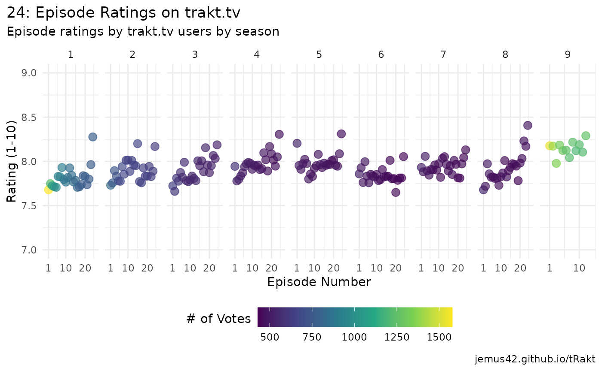

# Show Analysis: 24

``` r
library(tRakt)
library(dplyr)
library(ggplot2)
```

## Step 1: Search

Use the search function to find the show you’re looking for. The show
“24” is a particularly good example for a show with a bad name, because
If we just search for “24”, we’ll get a wrong result due to ambiguity.  
To nudge the search function to find the show we’re looking for, we can
specify the year of release:

``` r
show_info <- search_query("24", years = 2001, type = "show")
show_info
#> # A tibble: 1 × 35
#>     score type  title  year tagline    overview runtime country trailer homepage
#>     <dbl> <chr> <chr> <int> <chr>      <chr>      <int> <chr>   <chr>   <chr>   
#> 1 5.79e17 show  24     2001 A lot can… "Counte…      45 us      https:… https:/…
#> # ℹ 25 more variables: status <chr>, rating <dbl>, votes <int>,
#> #   comment_count <int>, updated_at <dttm>, language <chr>, languages <list>,
#> #   available_translations <list>, genres <list>, subgenres <list>,
#> #   original_title <chr>, first_aired <dttm>, aired_episodes <int>,
#> #   certification <chr>, network <chr>, airs_day <chr>, airs_time <chr>,
#> #   airs_timezone <chr>, trakt <chr>, slug <chr>, imdb <chr>, tmdb <chr>,
#> #   tvdb <chr>, plex_guid <chr>, plex_slug <chr>
```

Now we have the basic show info to work with, including the `title` and
various IDs.

## Step 2: Use the ID

Use the `trakt` ID for subsequent API calls, which is guaranteed to be
always available and unique on trakt.tv.  
Now we’ll use
[`seasons_summary()`](https://jemus42.github.io/tRakt/reference/seasons_summary.md)
to get data for all seasons of the show, while also getting an
additional list-column containing all episode data, which includes user
ratings.

``` r
seasons <- seasons_summary(show_info$trakt, extended = "full", episodes = TRUE)
glimpse(seasons)
#> Rows: 9
#> Columns: 16
#> $ title          <chr> "Season 1", "Season 2", "Season 3", "Season 4", "Season…
#> $ votes          <int> 506, 357, 302, 269, 247, 220, 209, 200, 206
#> $ season         <int> 1, 2, 3, 4, 5, 6, 7, 8, 9
#> $ rating         <dbl> 8.173913, 8.162465, 8.109271, 8.182157, 8.421053, 7.418…
#> $ network        <lgl> NA, NA, NA, NA, NA, NA, NA, NA, NA
#> $ overview       <chr> "Counter-terrorism agent Jack Bauer attempts to stop th…
#> $ updated_at     <dttm> 2026-03-02 02:32:10, 2026-03-02 02:32:10, 2026-03-02 02…
#> $ first_aired    <dttm> 2001-11-07 02:00:00, 2002-10-30 02:00:00, 2003-10-29 02…
#> $ episode_count  <int> 24, 24, 24, 24, 24, 24, 24, 24, 12
#> $ aired_episodes <int> 24, 24, 24, 24, 24, 24, 24, 24, 12
#> $ original_title <chr> "Season 1", "Season 2", "Season 3", "Season 4", "Season…
#> $ episodes       <list> [<tbl_df[24 x 21]>], [<tbl_df[24 x 21]>], [<tbl_df[24 …
#> $ tmdb           <chr> "5845", "5846", "5847", "5848", "5849", "5850", "5851"…
#> $ tvdb           <chr> "10063", "10064", "10065", "10066", "10067", "16794", "…
#> $ trakt          <chr> "6262", "6263", "6264", "6265", "6266", "6267", "6268",…
#> $ plex_guid      <chr> "602e68e0d17ae1002dc137f5", "602e68f2d17ae1002dc13d5e",…
```

## Step 3: Tidying up

We’re interested in the `$episodes` list-column, which needs unnesting.
In this case we can use
[`dplyr::bind_rows()`](https://dplyr.tidyverse.org/reference/bind_rows.html)
to take the list of `tibble`s and `rbind` them all together, meaning the
result is a `tibble` of the episode data we care about.

``` r
episodes <- bind_rows(seasons$episodes)
glimpse(episodes)
#> Rows: 204
#> Columns: 21
#> $ title                  <chr> "12:00 A.M.-1:00 A.M.", "1:00 A.M.-2:00 A.M.", …
#> $ votes                  <int> 1595, 1249, 1099, 1074, 1005, 963, 944, 935, 91…
#> $ episode                <int> 1, 2, 3, 4, 5, 6, 7, 8, 9, 10, 11, 12, 13, 14, …
#> $ rating                 <dbl> 7.655172, 7.726982, 7.710646, 7.702980, 7.69950…
#> $ season                 <int> 1, 1, 1, 1, 1, 1, 1, 1, 1, 1, 1, 1, 1, 1, 1, 1,…
#> $ runtime                <int> 43, 42, 43, 42, 42, 43, 43, 43, 43, 43, 43, 43,…
#> $ overview               <chr> "Moments after discovering his daughter, Kimber…
#> $ episode_abs            <int> 0, 0, 0, 0, 0, 0, 0, 0, 0, 0, 0, 0, 0, 0, 0, 0,…
#> $ updated_at             <dttm> 2026-03-02 02:28:27, 2026-03-02 02:28:27, 2026…
#> $ first_aired            <dttm> 2001-11-07 02:00:00, 2001-11-14 02:00:00, 2001…
#> $ episode_type           <chr> "series_premiere", "standard", "standard", "sta…
#> $ after_credits          <lgl> FALSE, FALSE, FALSE, FALSE, FALSE, FALSE, FALSE…
#> $ comment_count          <int> 8, 3, 2, 3, 3, 4, 3, 2, 2, 3, 1, 3, 1, 2, 4, 5,…
#> $ during_credits         <lgl> FALSE, FALSE, FALSE, FALSE, FALSE, FALSE, FALSE…
#> $ original_title         <chr> "12:00 A.M.-1:00 A.M.", "1:00 A.M.-2:00 A.M.", …
#> $ available_translations <list> [], [], [], [], [], [], [], [], [], [], [], []…
#> $ imdb                   <chr> "tt0502165", "tt0502167", "tt0502169", "tt05021…
#> $ tmdb                   <chr> "972745", "972752", "972753", "134397", "134398…
#> $ tvdb                   <chr> "189255", "189256", "189257", "189258", "189259…
#> $ trakt                  <chr> "146247", "146248", "146249", "146250", "146251…
#> $ plex_guid              <chr> "5d9c13506c3e37001ed024b3", "5d9c13506c3e37001e…
```

## Step 4: Graph!

Now we have our episode data in a tidy form, might as well look at it.

``` r
ggplot(data = episodes, aes(x = episode, y = rating, color = votes)) +
    geom_point(size = 3, alpha = 2 / 3) +
    facet_wrap(~season, nrow = 1, scales = "free_x") +
    scale_x_continuous(breaks = c(1, 10, 20), expand = c(0, 3)) +
    scale_y_continuous(breaks = seq(0, 10, .5), minor_breaks = seq(0, 10, .25), limits = c(7, 9)) +
    scale_color_viridis_c() +
    guides(color = guide_colorbar(barwidth = unit(6, "cm"), title.vjust = .75)) +
    labs(
        title = "24: Episode Ratings on trakt.tv",
        subtitle = "Episode ratings by trakt.tv users by season",
        x = "Episode Number",
        y = "Rating (1-10)",
        color = "# of Votes",
        caption = "jemus42.github.io/tRakt"
    ) +
    theme_minimal() +
    theme(
        plot.title.position = "plot",
        legend.position = "bottom"
    )
```


